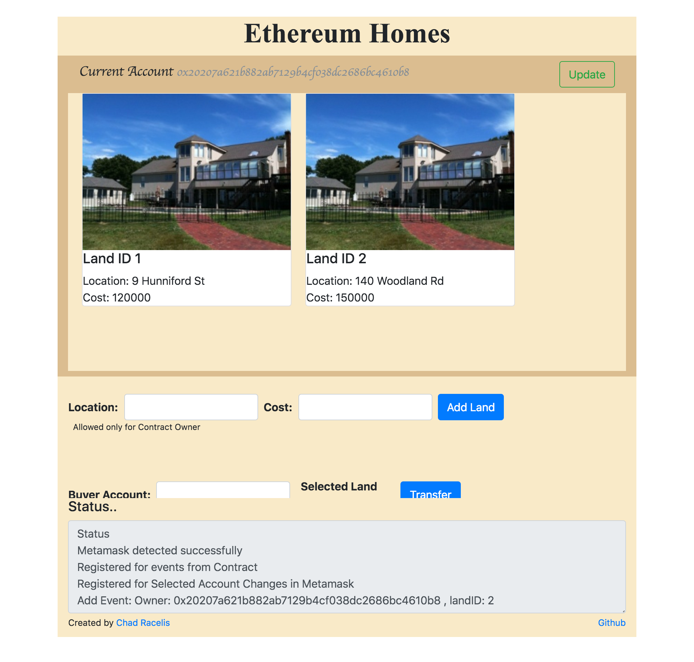

**Prerequisite:**   
1. Install Metamask Chrome Extension (this dapp not yet tested in any other browser)  

**Steps:**  
1. Deploy landContract_NEW.sol from contract folder in remix (use Metamask injected web3 environment)  
2. 'npm install'   
3. Update deployed contract's address and ABI from remix to config.js in project  
4. run 'node app.js'  
5. Open Dapp in localhost:8080. It should be able to connect to deployed contract via metamask.  

**Known issues:**  
1. Some events are received multiple times (jquery select, contract events etc)  
2. After launching Dapp, if new account created in Metamask, dapp may not work properly  
3. Sometimes contract actions (add node or transfer) are not completed.  

